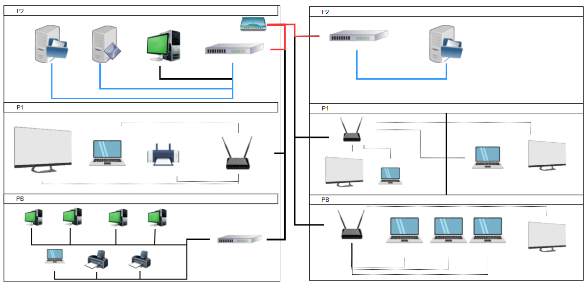

# Armado estructurado de red

## Consigna

Para una empresa que nos contrató para realizar el armado y diagramación de toda su infraestructura debemos colocar los siguientes componentes según las especificaciones que nos pidieron: 

1. El primer edificio de tres plantas se destinara a la producción y desarrollo de software, por lo cual se necesitara una sala de servidores donde estén los servidores de aplicación y archivos conectados a través de fibra óptica y una computadora para poder acceder a ellos si se lo necesitaría 
2. Dentro del primer edificio además se necesita un piso destinado a presentaciones donde realizaran semanalmente una Reunión todo el equipo de trabajo, para presentar los pasos a seguir, en esta habitación por petición de la empresa no puede haber ninguna conexión cableada y eventualmente necesitarían imprimir.
3. En el primer edificio se destinara una planta entera para la administración, la cual deberá contar con conexión cableada, 4 computadoras, dos impresoras y una notebook para el jefe del área 
4. El segundo edificio esta destinado a la venta y marketing de la empresa, pero por seguridad se colocara un servidor de archivos que hará las copias de respaldo del servidor del primer edificio. 
5. Un piso se dividirá en dos, y se dedicara exclusivamente a presentaciones de ventas del producto o reuniones del equipo de marketing 
6. Por ultimo se solicita una recepción donde tres personas recibirán a los clientes y habrá una pantalla pasando propagandas del producto de la empresa, por petición de la empresa no tiene que haber cables a la vista. 
7. Ambos edificios deberan comunicarse entre si y poder ver los recursos del otro, como ser el servidor de aplicaciones por ejemplo

## Resolución

