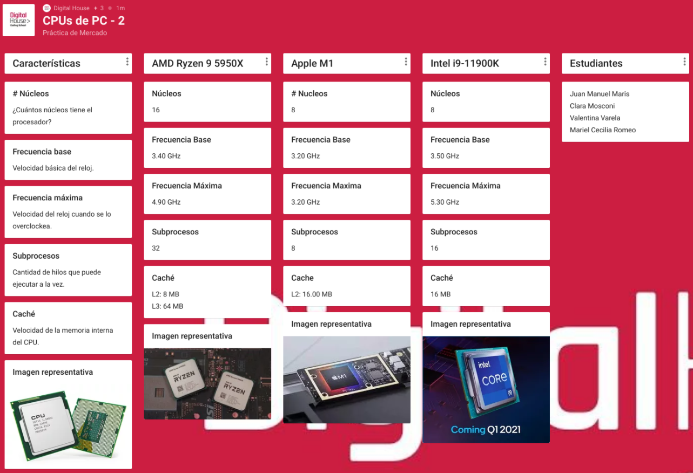

# Práctica de mercado

1. Hacer un análisis del mercado actual, investigando las características de los CPU
utilizados en el dispositivo asignado en el padlet, el cual corresponde a la gama más
alta del mercado.

2. Hacer una conclusión valorativa de las comparaciones realizadas y exponerlas en el
debate que se realizará al finalizar la práctica.